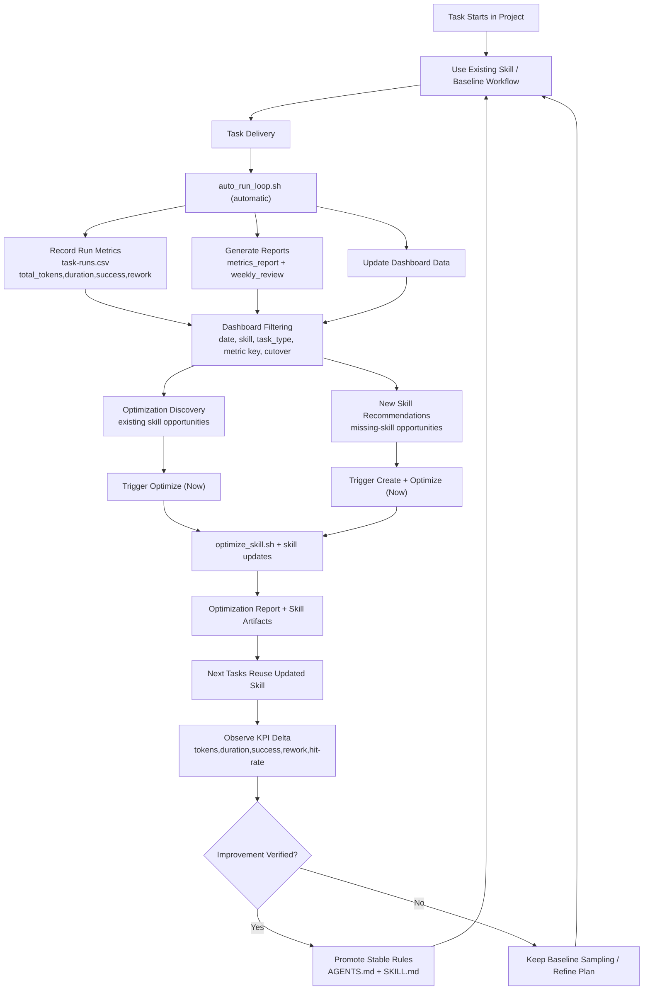

# Agent Auto Self-Optimizing Closed Loop (User Guide)

<!-- README_SYNC_VERSION: 2026-03-09 -->

This project helps you run a measurable self-optimization loop for AI coding work.
If your goal is to use the skill in your own repository, this file is the entry point.

If you maintain this repository itself, use [README_ANCHOR.md](README_ANCHOR.md).

Companion docs:

- [中文说明](README_CN.md)
- [Author Anchor Guide](README_ANCHOR.md)
- [Closed-Loop Playbook](docs/closed-loop-playbook.md)
- [Measurement Framework](docs/measurement-framework.md)

## 1. What You Get as a User

After setup, you get a repeatable loop with concrete outputs:

1. Automatic run logging + metrics + weekly review with one command.
2. Skill impact reports (`token_reduction_pct`, `duration_reduction_pct`, etc.).
3. Filterable local web dashboard (date, skill, cutover, metric key filter).
4. Skill optimization discovery with immediate optimize/create actions from dashboard.
5. Clear pre/post comparison around a chosen cutover date.

In your project, data is stored under `.agent-loop-data/`:

- `metrics/task-runs.csv`
- `knowledge-base/errors/`
- `reports/`
- `templates/error-entry.md`

## 2. Install `aoso-skill` CLI (No Submodule)

Use either Homebrew or pipx:

```bash
brew tap korilin/aoso-skill https://github.com/korilin/agent-auto-self-optimizing-closed-loop
brew install aoso-skill
```

```bash
pipx install "git+https://github.com/korilin/agent-auto-self-optimizing-closed-loop.git"
```

Then install or update runtime skill assets:

```bash
aoso-skill update
aoso-skill help
```

## 3. Initialize Your Project Once

Run this in the target project root:

```bash
aoso-skill init --workspace "$(pwd)"
```

Expected result:

- `.agent-loop-data/metrics/task-runs.csv` created (with header).
- `.agent-loop-data/knowledge-base/errors/` created.
- `.agent-loop-data/reports/` created.
- `.agent-loop-data/templates/error-entry.md` created.
- `AGENTS.md` gets/refreshes a managed `AOSO-SKILL` block.

## 4. Daily Workflow (Fully Automated Path)

1. In agent workflow, this command should be auto-executed at task completion (collect + analyze + review):

```bash
SKILL_HOME="${CODEX_HOME:-$HOME/.codex}/skills/agent-self-optimizing-loop"
"${SKILL_HOME}/scripts/auto_run_loop.sh" \
  --task-id TASK-1001 \
  --task-type debug \
  --project my-service \
  --model gpt-5 \
  --used-skill true \
  --skill-name log-analysis-helper \
  --total-tokens 1820 \
  --duration-sec 420 \
  --success true \
  --rework-count 0
```

If telemetry is not passed explicitly, `auto_run_loop.sh` will try to resolve real values from
local Codex session logs (`$CODEX_HOME/sessions` and `$CODEX_HOME/archived_sessions`, using
`CODEX_THREAD_ID` when available). For non-Codex runners, keep passing `total_tokens` /
`duration_sec` (or set env vars such as `CODEX_TOTAL_TOKENS` and `CODEX_TASK_DURATION_SEC`).

2. Open dashboard for filtering, optimization discovery, and direct optimization:

```bash
aoso-skill dashboard --workspace "$(pwd)" --host 127.0.0.1 --port 8765
```

Then open `http://127.0.0.1:8765`.
Use the `Skill Optimization Discovery` section to optimize one skill immediately.
Use `New Skill Recommendations` to create-and-optimize a new skill immediately.

3. Optional direct report commands (if you need raw CLI output):

```bash
SKILL_HOME="${CODEX_HOME:-$HOME/.codex}/skills/agent-self-optimizing-loop"
"${SKILL_HOME}/scripts/metrics_report.sh" --all
"${SKILL_HOME}/scripts/metrics_report.sh" --skill log-analysis-helper
"${SKILL_HOME}/scripts/metrics_report.sh" --all --cutover YYYY-MM-DD
```

4. Upgrade runtime skill when needed:

```bash
aoso-skill update
```

### Complete Closed-Loop Flow



How to read this flow:

1. Every completed task writes one standardized run record.
2. Reports and dashboard always read from the same local data source (`.agent-loop-data/`).
3. Optimization can be triggered directly from dashboard for both existing skills and new-skill recommendations.
4. Optimized artifacts are applied immediately and reused by subsequent tasks.
5. Only verified gains should be promoted into long-term governance (`AGENTS.md`) and stable skill instructions.

## 5. How to Interpret Results Correctly

Use these rules to avoid false conclusions:

1. Trust skill comparison only when there is no-skill baseline on the same `task_type`.
2. If output says `insufficient baseline`, collect more baseline samples first.
3. Read `success_rate_delta_pp` and `rework_rate_delta` together with token reduction.
4. Use `--cutover` only when both pre and post windows have enough samples.
5. In dashboard, use date range + skill filter before comparing metric trends.

## 6. Author/Maintainer Entry

All maintainer-facing instructions were moved to [README_ANCHOR.md](README_ANCHOR.md), including:

1. Repository change workflow.
2. Required validation scripts.
3. README synchronization rules.
4. Commit gates and release checks.

If your role is user only, you can stop at Sections 1-5.
