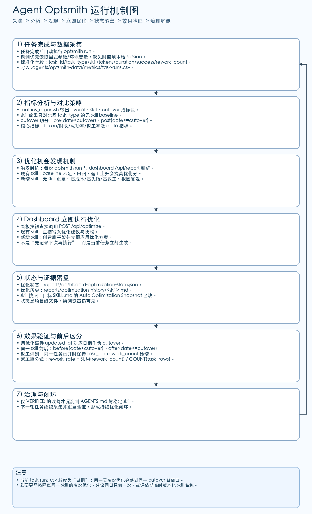

# Agent Optsmith 使用指南

<!-- README_SYNC_VERSION: 2026-03-11 -->

这个项目用于在你的工程里落地“可量化”的 Agent Optsmith 流程。
这份 README 是安装和日常运行的主入口。

配套文档：

- [English Guide](README.md)
- [优化运行手册](docs/optsmith-playbook.md)
- [指标评估方法](docs/measurement-framework.md)

## 1. 核心能力

初始化完成后，你会得到一套稳定优化流程和清晰产物：

1. 一条命令自动完成记录 + 分析 + 周报。
2. skill 效果评估（`token_reduction_pct`、`duration_reduction_pct` 等）。
3. 本地可筛选 Web 看板（日期、skill、cutover、指标关键字）。
4. skill 优化机会自动发现，并支持在看板中立即执行优化/创建。
5. 指定切换日期后的 pre/post 对比结果。

数据默认在你的项目目录 `.agents/optsmith-data/` 下：

- `metrics/task-runs.csv`
- `knowledge-base/errors/`
- `reports/`
- `templates/error-entry.md`

## 2. 安装 `optsmith` CLI

可选 Homebrew 或 pipx：

```bash
brew tap korilin/optsmith https://github.com/korilin/agent-optsmith
brew install optsmith
```

```bash
pipx install "git+https://github.com/korilin/agent-optsmith.git"
```

然后验证 CLI 可用：

```bash
optsmith version
optsmith help
```

## 3. 在你的项目里做一次初始化

在目标项目根目录运行：

```bash
optsmith install --workspace "$(pwd)"
```

install 参数说明：

- `--workspace <path>`：目标项目目录（默认当前目录）。
- `--data-dir <path>`：指标/知识库/报告的数据根目录（默认 `.agents/optsmith-data`）。
- `--skill-path <path>`：项目 skill 根目录，`agent-optsmith` 会安装到该目录下（默认 `.agents/skills`）。
- `--skip-agents`：跳过写入/更新 `AGENTS.md` 的 `OPTSMITH-SKILL` 托管区块。

路径规则：

- 相对路径会按 `--workspace` 进行解析。
- 出于安全考虑，`data-dir` 和 `skill-path` 必须位于 workspace 内。

自定义目录示例：

```bash
optsmith install \
  --workspace "$(pwd)" \
  --data-dir ".agents/custom-optsmith-data" \
  --skill-path ".agents/custom-skills"
```

预期结果：

- 自动创建 `.agents/optsmith-data/metrics/task-runs.csv`（含表头）。
- 自动创建 `.agents/optsmith-data/knowledge-base/errors/`。
- 自动创建 `.agents/optsmith-data/reports/`。
- 自动创建 `.agents/optsmith-data/templates/error-entry.md`。
- 自动安装 `<workspace>/.agents/skills/agent-optsmith`（当前 CLI 版本对应 skill）。
- 自动更新或创建 `AGENTS.md` 中的 `OPTSMITH-SKILL` 托管区块（含 `skill_dir`、`data_dir`）。

## 4. 日常使用路径（全自动）

1. 在 agent 工作流中，任务完成后应自动执行此命令（采集 + 分析 + 周报）：

```bash
optsmith run --workspace "$(pwd)" \
  --task-id TASK-1001 \
  --task-type debug \
  --project my-service \
  --model gpt-5 \
  --used-skill true \
  --skill-name log-analysis-helper \
  --total-tokens 1820 \
  --duration-sec 420 \
  --success true \
  --rework-count 0
```

如果未显式传入 telemetry，`optsmith run` 会尝试从本地 Codex session 日志
自动解析真实值（`$CODEX_HOME/sessions` 和 `$CODEX_HOME/archived_sessions`，有
`CODEX_THREAD_ID` 时优先按线程匹配）。在非 Codex 运行器里，仍建议显式传入
`total_tokens` / `duration_sec`（或设置 `CODEX_TOTAL_TOKENS`、`CODEX_TASK_DURATION_SEC`）。

2. 打开看板做筛选、优化发现和直接执行：

```bash
optsmith dashboard --workspace "$(pwd)" --host 127.0.0.1 --port 8765
```

然后访问 `http://127.0.0.1:8765`。
在 `Skill Optimization Discovery` 区域可对现有 skill 立即执行优化。
在 `New Skill Recommendations` 区域可一键创建并优化新增 skill。
新增或优化后的 skill 文件默认写入项目 `.agents/skills/`（Codex 可自动读取的项目级目录）。
项目内不再回退扫描旧目录 `skills/`。如需自定义路径，请设置 `OPTSMITH_LOCAL_SKILLS_DIR`。

3. 如需原始命令输出（可选）：

```bash
optsmith metrics --workspace "$(pwd)" --all
optsmith metrics --workspace "$(pwd)" --skill log-analysis-helper
optsmith metrics --workspace "$(pwd)" --all --cutover YYYY-MM-DD
optsmith optimize --workspace "$(pwd)" --skill log-analysis-helper
```

4. 需要把项目内 skill 更新到当前 CLI 版本时执行：

```bash
optsmith update --workspace "$(pwd)"
```

5. 需要移除项目集成时执行：

```bash
optsmith uninstall --workspace "$(pwd)"
```

### 完整 Agent Optsmith 流程图



这张图建议按阶段阅读：

1. 第 1-2 阶段：任务采集与指标计算规则。
2. 第 3-4 阶段：机会发现触发与立即优化执行。
3. 第 5-6 阶段：优化状态落盘与前后效果验证方法。
4. 第 7 阶段：仅将已验证收益沉淀到治理规则。
5. 图底部注意事项：日期粒度限制与严格对比建议。

## 5. 如何正确解读输出

### 5.1 效果验证策略（到底在比较什么）

1. skill 级效果：
- 每个 skill 只与同 `task_type` 的无 skill baseline 对比。
- `token_reduction_pct = (baseline_avg_tokens - skill_avg_tokens) / baseline_avg_tokens`
- `duration_reduction_pct = (baseline_avg_duration - skill_avg_duration) / baseline_avg_duration`
- `success_rate_delta_pp = skill_success_rate - baseline_success_rate`
- `rework_rate_delta = skill_rework_rate - baseline_rework_rate`

2. 流程级 cutover 前后效果：
- `pre` 窗口：`date < cutover`
- `post` 窗口：`date >= cutover`
- `delta_avg_tokens_pct = (post_avg_tokens - pre_avg_tokens) / pre_avg_tokens`
- `delta_avg_duration_pct = (post_avg_duration - pre_avg_duration) / pre_avg_duration`
- `delta_success_rate_pp = post_success_rate - pre_success_rate`
- `delta_tasks_per_day_pct = (post_tasks_per_day - pre_tasks_per_day) / pre_tasks_per_day`

3. 推荐验证顺序：
- 先跑 `optsmith metrics --workspace "$(pwd)" --skill <skill-name>` 看 skill 对 baseline 的效果。
- 再跑 `optsmith metrics --workspace "$(pwd)" --all --cutover YYYY-MM-DD` 看流程级前后变化。
- 最后在 dashboard 做日期 + skill 筛选，看趋势是否一致。

### 5.2 同一个 Skill 的优化前后如何区分

1. 优化事件会落盘到项目文件：
- `.agents/optsmith-data/reports/dashboard-optimization-state.json`（含 `updated_at`、动作、得分、状态）。
- `.agents/optsmith-data/reports/optimization-history/<skill>.md`（时间戳优化日志）。
- 被优化 skill 的 `SKILL.md` 自动快照区块（含 `updated_at`、状态、来源报告）。

2. 建议把优化事件日期（`updated_at` -> `YYYY-MM-DD`）作为 cutover。

3. 标准切分方法：
- `before`：`date < cutover` 的任务行。
- `after`：`date >= cutover` 的任务行。
- 解释 skill delta 时仍需满足“同 task_type baseline”的约束。

4. 当前数据粒度是按天（`date`），不是时间戳级：
- 同一天内多次优化会落在同一个 cutover 日窗口里。
- 若要严格隔离，建议同一 skill 每天最多做一次优化，或评估期临时采用版本化 skill 名称。

### 5.3 返工的定义、识别与计算

1. 任务标识约定：
- 同一个业务任务被重开时，`task_id` 必须保持不变。

2. 返工识别约定：
- 已交付任务被重开（例如 QA 失败、需求未满足、回滚后补修），下一次完成时应继续用同一个 `task_id`，并提升 `rework_count`。
- `rework_count=0` 表示首次通过完成。
- `rework_count=1/2/...` 表示该次完成前经历了 1/2/... 轮重开。

3. 当前工具中的返工率公式：
- `rework_rate = SUM(rework_count) / COUNT(task_rows)`

4. 关键注意：
- 系统不会跨不同 `task_id` 自动推断返工。
- 如果团队在重开时换了 `task_id`，返工率会被低估。

### 5.4 Dashboard 的优化发现规则（为什么会被标记）

1. 现有 skill 的机会评分会在这些信号出现时升高：
- 匹配 task_type 的 baseline 不足
- token 或耗时相对 baseline 变差
- 成功率下降
- 返工率上升

2. 新增 skill 推荐会在这些信号出现时升高：
- 某 task_type 的无 skill 任务重复出现（`>=3`）
- 无 skill 的 token/耗时显著偏高
- 失败率/返工率偏高
- error KB 出现复发根因

3. 触发时机：
- 每次 `optsmith run`
- 每次 dashboard `/api/report` 刷新

### 5.5 防误判检查清单

1. 出现 `insufficient baseline` 时不要下优化结论。
2. 不要只看 token，要结合成功率和返工率。
3. skill 效果只比较同 `task_type`。
4. 用 cutover 做前后对比时，pre/post 两侧都要有足够样本。
5. 只有在 post 窗口持续改善后，才算 `VERIFIED` 并建议沉淀规则。

## 6. 命令速查

1. 在当前项目初始化：
- `optsmith install --workspace "$(pwd)"`
2. 记录并分析一次已完成任务：
- `optsmith run --workspace "$(pwd)" ...`
3. 打开本地看板：
- `optsmith dashboard --workspace "$(pwd)" --host 127.0.0.1 --port 8765`
4. 直接查看指标：
- `optsmith metrics --workspace "$(pwd)" --all`
- `optsmith metrics --workspace "$(pwd)" --skill <skill-name>`
5. 更新或移除项目集成：
- `optsmith update --workspace "$(pwd)"`
- `optsmith uninstall --workspace "$(pwd)"`
