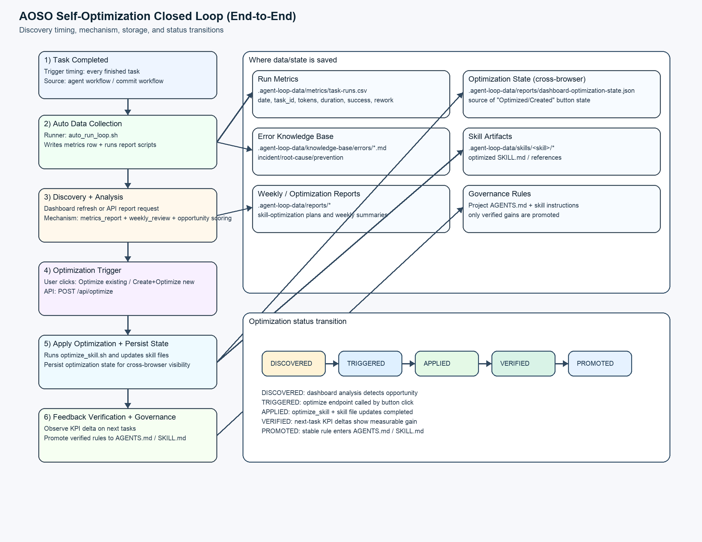

# Agent Optsmith（用户手册）

<!-- README_SYNC_VERSION: 2026-03-10 -->

这个项目用于在你的工程里落地“可量化”的 Agent 优化工匠流程。
如果你的目标是“作为 skill 使用者快速上手”，请从这份 README 开始。

如果你是维护本仓库的作者，请看 [README_ANCHOR.md](README_ANCHOR.md)。

配套文档：

- [English Guide](README.md)
- [作者锚点说明](README_ANCHOR.md)
- [优化运行手册](docs/optsmith-playbook.md)
- [指标评估方法](docs/measurement-framework.md)

## 1. 作为用户你能得到什么

初始化完成后，你会得到一套稳定优化流程和清晰产物：

1. 一条命令自动完成记录 + 分析 + 周报。
2. skill 效果评估（`token_reduction_pct`、`duration_reduction_pct` 等）。
3. 本地可筛选 Web 看板（日期、skill、cutover、指标关键字）。
4. skill 优化机会自动发现，并支持在看板中立即执行优化/创建。
5. 指定切换日期后的 pre/post 对比结果。

数据默认在你的项目目录 `.agents/optsmith-data/` 下：

- `metrics/task-runs.csv`
- `knowledge-base/errors/`
- `reports/`
- `templates/error-entry.md`

## 2. 安装 `optsmith` CLI

可选 Homebrew 或 pipx：

```bash
brew tap korilin/optsmith https://github.com/korilin/agent-optsmith
brew install optsmith
```

```bash
pipx install "git+https://github.com/korilin/agent-optsmith.git"
```

然后验证 CLI 可用：

```bash
optsmith help
```

## 3. 在你的项目里做一次初始化

在目标项目根目录运行：

```bash
optsmith install --workspace "$(pwd)"
```

预期结果：

- 自动创建 `.agents/optsmith-data/metrics/task-runs.csv`（含表头）。
- 自动创建 `.agents/optsmith-data/knowledge-base/errors/`。
- 自动创建 `.agents/optsmith-data/reports/`。
- 自动创建 `.agents/optsmith-data/templates/error-entry.md`。
- 自动安装 `<workspace>/.agents/skills/agent-optsmith`（当前 CLI 版本对应 skill）。
- 自动更新或创建 `AGENTS.md` 中的 `OPTSMITH-SKILL` 托管区块（含 `skill_dir`、`data_dir`）。

## 4. 日常使用路径（全自动）

1. 在 agent 工作流中，任务完成后应自动执行此命令（采集 + 分析 + 周报）：

```bash
optsmith run --workspace "$(pwd)" \
  --task-id TASK-1001 \
  --task-type debug \
  --project my-service \
  --model gpt-5 \
  --used-skill true \
  --skill-name log-analysis-helper \
  --total-tokens 1820 \
  --duration-sec 420 \
  --success true \
  --rework-count 0
```

如果未显式传入 telemetry，`optsmith run` 会尝试从本地 Codex session 日志
自动解析真实值（`$CODEX_HOME/sessions` 和 `$CODEX_HOME/archived_sessions`，有
`CODEX_THREAD_ID` 时优先按线程匹配）。在非 Codex 运行器里，仍建议显式传入
`total_tokens` / `duration_sec`（或设置 `CODEX_TOTAL_TOKENS`、`CODEX_TASK_DURATION_SEC`）。

2. 打开看板做筛选、优化发现和直接执行：

```bash
optsmith dashboard --workspace "$(pwd)" --host 127.0.0.1 --port 8765
```

然后访问 `http://127.0.0.1:8765`。
在 `Skill Optimization Discovery` 区域可对现有 skill 立即执行优化。
在 `New Skill Recommendations` 区域可一键创建并优化新增 skill。
新增或优化后的 skill 文件默认写入项目 `.agents/skills/`（Codex 可自动读取的项目级目录）。
项目内不再回退扫描旧目录 `skills/`。如需自定义路径，请设置 `OPTSMITH_LOCAL_SKILLS_DIR`。

3. 如需原始命令输出（可选）：

```bash
optsmith metrics --workspace "$(pwd)" --all
optsmith metrics --workspace "$(pwd)" --skill log-analysis-helper
optsmith metrics --workspace "$(pwd)" --all --cutover YYYY-MM-DD
optsmith optimize --workspace "$(pwd)" --skill log-analysis-helper
```

4. 需要把项目内 skill 更新到当前 CLI 版本时执行：

```bash
optsmith update --workspace "$(pwd)"
```

5. 需要移除项目集成时执行：

```bash
optsmith uninstall --workspace "$(pwd)"
```

### 完整 Agent 优化工匠流程图



这张图的阅读顺序：

1. 优化发现时机：
- 每次任务完成触发 `optsmith run`，以及每次 dashboard 刷新 `/api/report` 时都会重新计算优化机会。
2. 优化发现机制：
- 基于 `optsmith metrics`、weekly review、机会评分和新增 skill 推荐逻辑得出候选项。
3. 数据记录保存位置：
- 运行记录：`.agents/optsmith-data/metrics/task-runs.csv`
- 失败知识库：`.agents/optsmith-data/knowledge-base/errors/*.md`
- 优化报告：`.agents/optsmith-data/reports/skill-optimization/*`
4. 优化状态保存位置：
- `.agents/optsmith-data/reports/dashboard-optimization-state.json`
- 这是项目共享文件，所以换浏览器后仍能看到已优化/已创建状态。
5. 状态变化链路：
- `DISCOVERED -> TRIGGERED -> APPLIED -> VERIFIED -> PROMOTED`
- 只有 `VERIFIED` 的收益才建议沉淀到 `AGENTS.md` 与稳定 skill。

## 5. 如何正确解读输出

本工具的对比口径如下：

1. 单个 skill 只和同 `task_type` 的 no-skill baseline 对比。
2. skill 级效果：
- `token_reduction_pct = (baseline_avg_tokens - skill_avg_tokens) / baseline_avg_tokens`
- `duration_reduction_pct = (baseline_avg_duration - skill_avg_duration) / baseline_avg_duration`
- `success_rate_delta_pp = skill_success_rate - baseline_success_rate`
- `rework_rate_delta = skill_rework_rate - baseline_rework_rate`
3. cutover 前后效果：
- `delta_avg_tokens_pct = (post_avg_tokens - pre_avg_tokens) / pre_avg_tokens`
- `delta_avg_duration_pct = (post_avg_duration - pre_avg_duration) / pre_avg_duration`
- `delta_success_rate_pp = post_success_rate - pre_success_rate`
- `delta_tasks_per_day_pct = (post_tasks_per_day - pre_tasks_per_day) / pre_tasks_per_day`

避免误判时，按这 5 条看：

1. 只有同 `task_type` 存在 no-skill baseline，skill 对比才可靠。
2. 出现 `insufficient baseline` 说明样本不足，先补 baseline。
3. 不要只看 token，需结合 `success_rate_delta_pp` 和 `rework_rate_delta`。
4. `--cutover` 对比需要 pre/post 都有足够样本。
5. 在看板中先做日期和 skill 筛选，再比较指标趋势。

## 6. 作者/维护者入口

所有作者维护说明已集中到 [README_ANCHOR.md](README_ANCHOR.md)，包括：

1. 仓库变更流程。
2. 必跑校验脚本。
3. README 中英文同步规则。
4. 提交前门禁与发布检查。

如果你只是 skill 使用者，按 1-5 节执行即可。
